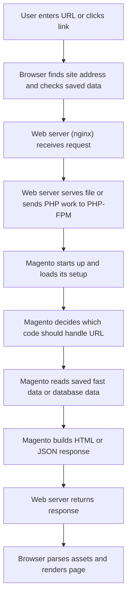

# How the Web Works End to End

!!! note
    This page is a map, not a test. You do not need to fully understand every term on the first read. The goal is to see the big picture first, then learn the names of each part.

## What it is

This page explains the full path from typing a URL in a browser to seeing HTML, JSON, or assets rendered on screen.

## Quick visual walkthrough

  

    

      

        
        
shop.example.com/product

      

      

        

          <strong>Product page</strong>
          Customer opens item
        

        

        

        

        
Add to cart

        

          <strong>Page rendered</strong>
          HTML returned
          CSS and JS applied
        

      

    

    

      

        <strong>Web server</strong>
        Receives request first
        Can serve static files
      

      

        <strong>PHP</strong>
        Runs PHP code
        Starts Magento
      

      

        <strong>Magento app</strong>
        Matches route
        Builds response
      

      

        

          <strong>Fast data</strong>
          Cache / session
        

        

          <strong>Database</strong>
          Durable data
        

      

      
GET /product

      
HTML response

    

  

  

    
1. Browser asks for page

    
2. Web server receives request

    
3. PHP starts Magento

    
4. Magento loads needed data

    
5. Response returns and page renders

  

This loop is meant to make the order feel familiar. It is not trying to teach every technical detail at once.

## Terms used in this page

Before going deeper, here is the same vocabulary in plain English:

- `DNS`: how the browser finds the address of the site
- `cache`: saved data used to avoid repeating work
- `nginx`: the web server that receives the request first
- `PHP-FPM`: the PHP worker process that actually runs PHP code
- `bootstrap`: the app startup step
- `route`: the rule that decides which code handles the URL
- `database`: durable stored data such as products, customers, and orders
- `assets`: files like CSS, JavaScript, images, and fonts

## Why it exists

Without this model, it is hard to debug problems because every issue feels like “Magento is broken.” In reality, a problem may belong to:

- how the browser found the site
- the web server
- the PHP worker process
- saved cached data
- Magento routing or business logic
- database access
- frontend rendering in the browser

## When to use it

Use this model when you need to reason about:

- where a request starts
- who owns a failure
- where latency comes from
- why a page differs between users or environments

## Alternative approaches

The wrong alternative is to think of “the site” as one box. Real systems are layered:

- browser handles rendering and client-side behavior
- the web server (`nginx`) handles the first HTTP entry and static files
- the PHP worker layer (`PHP-FPM`) runs PHP code
- Magento coordinates application logic
- storage layers such as Redis and MySQL provide different kinds of saved data

## Magento-specific example

A shopper opens a product page:

1. The browser requests `/catalog/product/view` or a rewritten product URL.
2. The web server receives the request and forwards PHP work to PHP-FPM.
3. Magento starts up, decides which code should handle the URL, and builds the page.
4. Magento may read cache from Redis and product data from MySQL.
5. The final HTML goes back through nginx to the browser.

If the HTML is correct but the page still looks wrong, the issue may be frontend assets or browser-side JavaScript rather than backend PHP.

## Common mistakes

- Thinking the web server executes PHP. It does not. It passes that work to PHP-FPM.
- Thinking Magento stores everything in one place. It often uses Redis for fast temporary data and MySQL for durable business data.
- Thinking the browser just displays HTML. It also runs JavaScript, caches assets, and can change what the user sees after the response arrives.
- Debugging only application code when the failure is actually before Magento or after Magento.

## Related pages

- [HTTP, Headers, Cookies, and Sessions](http-requests-responses-headers-cookies-sessions.md)
- [Magento Request Lifecycle](../03-magento-core/magento-request-lifecycle.md)
- [Nginx, PHP-FPM, MySQL, Redis: Who Does What](../04-runtime-devops/nginx-php-fpm-mysql-redis-who-does-what.md)
