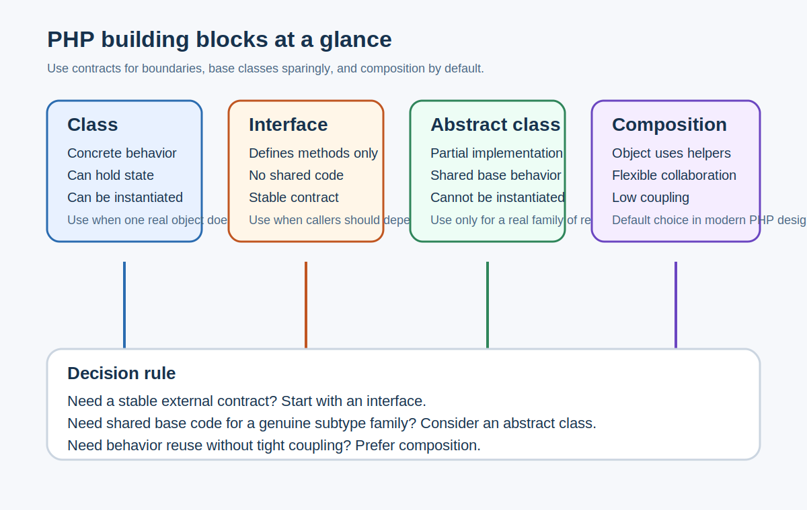

# PHP OOP: Classes, Interfaces, Abstract Classes, Inheritance, Composition

## What it is

These are the main building blocks for structuring object-oriented PHP code:

- class: a concrete object with state and behavior
- interface: a contract with required methods but no implementation details
- abstract class: a partially implemented base class
- inheritance: one class extending another
- composition: one class using other classes to do work

## Why it exists

As applications grow, code needs structure. OOP tools exist to separate responsibilities, reduce duplication, and make behavior easier to replace or test.

## When to use it

Use these concepts when:

- designing service classes
- sharing behavior across related objects
- swapping implementations
- testing with fake dependencies
- reading framework code like Magento service contracts and models

## Alternative approaches

There are two common bad extremes:

- everything in one giant concrete class
- deep inheritance chains used just to reuse code

Modern PHP usually prefers composition first, interfaces when a stable contract matters, and abstract classes only when shared base behavior is genuinely useful.

## Magento-specific example

Magento often defines a public interface such as a repository or service contract, then injects an implementation through dependency injection. That lets the rest of the system depend on behavior, not a specific class name.

A typical pattern is:

- interface defines the methods
- concrete class implements them
- another service receives the interface in its constructor

That is why Magento code often looks more abstract than plain PHP apps at first.

## Common mistakes

- Using inheritance when composition is simpler.
- Creating interfaces for classes that will never have another implementation or stable external contract.
- Putting too much logic into abstract base classes.
- Thinking interfaces store shared code. They do not.

## Related pages

- [Why Interfaces Exist](why-interfaces-exist-and-when-not-to-use-them.md)
- [Magento Request Lifecycle](../03-magento-core/magento-request-lifecycle.md)

