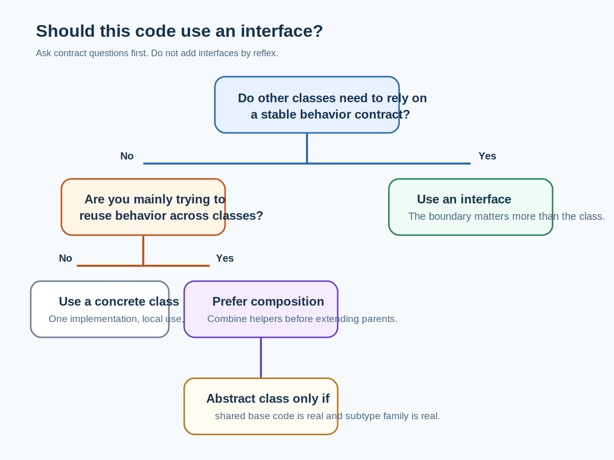

# Why Interfaces Exist, and When Not to Use Them



## What it is

An [interface](../glossary.md#interface) is a contract. It tells other code, “you can rely on these methods being available,” without forcing it to know or care which concrete class actually provides the behavior.

## Why it exists

Interfaces reduce coupling. Code can depend on behavior instead of one hard-coded implementation. This matters when:

- a framework injects implementations
- multiple implementations are valid
- testing needs a fake or stub
- one module exposes stable behavior to another

## When to use it

Use an interface when:

- the contract is more important than the class
- another module or team should depend on behavior, not internals
- you expect more than one implementation now or later
- the interface is part of a public API or service contract

## Alternative approaches

Alternatives exist, and they are often better:

- use a concrete class when there is only one internal implementation
- use composition when you are trying to combine behavior rather than create a subtype
- use an abstract class when you need shared code and a family of closely related subclasses

Do not create interfaces only because “enterprise code should have them everywhere.” That creates noise without buying flexibility.

## Tiny code example

Without an interface:

```php
<?php

final class FileLogger
{
    public function log(string $message): void
    {
        // Write message to file.
    }
}

final class OrderService
{
    public function __construct(private FileLogger $logger)
    {
    }

    public function place(): void
    {
        $this->logger->log('Order placed');
    }
}
```

This works, but `OrderService` is now tied directly to `FileLogger`.

With an interface:

```php
<?php

interface LoggerInterface
{
    public function log(string $message): void;
}

final class FileLogger implements LoggerInterface
{
    public function log(string $message): void
    {
        // Write message to file.
    }
}

final class OrderService
{
    public function __construct(private LoggerInterface $logger)
    {
    }

    public function place(): void
    {
        $this->logger->log('Order placed');
    }
}
```

Now `OrderService` depends on “something that can log,” not on one exact class. That matters when:

- Magento injects the implementation
- tests use a fake logger
- another logger implementation is added later

## Magento-specific example

Magento uses interfaces heavily for service contracts, repositories, search results, and many framework-level extension points. That makes sense because modules need stable boundaries.

Inside a small local-only helper, an interface may add ceremony without real value. The question is not “are interfaces good?” The question is “does this boundary need a contract?”

## Common mistakes

- Creating `FooInterface` only because `Foo` exists.
- Assuming interfaces are automatically better design.
- Using interfaces to share code. They cannot.
- Forgetting that too many trivial contracts make code harder to navigate.

## Related pages

- [PHP OOP Foundations](php-oop-classes-interfaces-abstract-classes-inheritance-composition.md)
- [Magento Request Lifecycle](../03-magento-core/magento-request-lifecycle.md)
