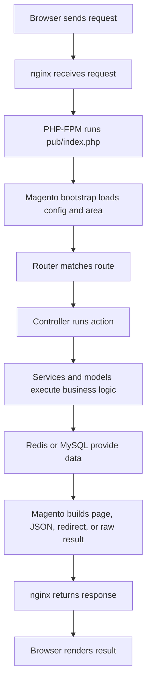

# Magento Request Lifecycle

!!! note
    Read this page in two passes. First pass: follow the path from top to bottom. Second pass: learn the Magento names for each step.

## What it is

This page explains how a web request moves through Magento and comes back as a page, JSON response, redirect, or other result.

## Simple path first

Before the Magento vocabulary, the simple version is:

1. browser asks for a URL
2. web server receives the request
3. PHP starts Magento
4. Magento decides which code should handle the URL
5. that code loads data and prepares a result
6. the result goes back to the browser

That is the whole shape. The rest of this page just gives names to those steps.

## Terms used in this page

- `route`: rule that decides which code should handle a URL
- `router`: part that checks routes
- `controller`: code entry point for a matched request
- `layout`: Magento page structure system
- `block`: Magento class that helps prepare page data
- `area`: Magento context such as storefront, admin, or API
- `plugin`: code that changes behavior around a method call
- `observer`: code that reacts to an event
- `object manager`: Magento container that creates objects and resolves dependencies

## Why it exists

Magento is a large framework. Without a request lifecycle model, it is hard to know where things fit:

- routing
- page building
- dependency injection
- plugins and observers
- database access
- cache reads

Once the path is clear, the framework feels less mysterious.

## When to use it

Use this model when:

- tracing a storefront or admin page
- debugging why a controller did not run
- understanding why one Magento area behaves differently from another
- deciding where a plugin or observer should attach

## Alternative approaches

The wrong alternative is to picture Magento as one giant black box that “just handles the request.”

In reality, request handling is staged:

- startup loads configuration and prepares objects
- router checks which action should handle the URL
- controller returns a result type
- deeper services and models perform business logic

## Magento-specific example

A category page request can involve:

1. nginx forwarding to `pub/index.php`
2. Magento starting in the storefront area
3. router matching the URL to a controller
4. controller returning a page result
5. layout and blocks building the page structure
6. product/category services loading data
7. cache layers reducing repeated work

For REST endpoints, Magento runs through a different area and dispatch path. That is why assumptions from normal storefront pages do not always apply to API requests.

## Common mistakes

- Assuming a plugin in one area will apply everywhere.
- Debugging layout when the request never reached a page result.
- Looking at controller code when the URL never matched the expected router.
- Forgetting that Magento has extra runtime layers that can change the exact call path.

## Related pages

- [How the Web Works End to End](../01-web-foundations/how-the-web-works-end-to-end.md)
- [HTTP, Headers, Cookies, and Sessions](../01-web-foundations/http-requests-responses-headers-cookies-sessions.md)
- [Nginx, PHP-FPM, MySQL, Redis: Who Does What](../04-runtime-devops/nginx-php-fpm-mysql-redis-who-does-what.md)
