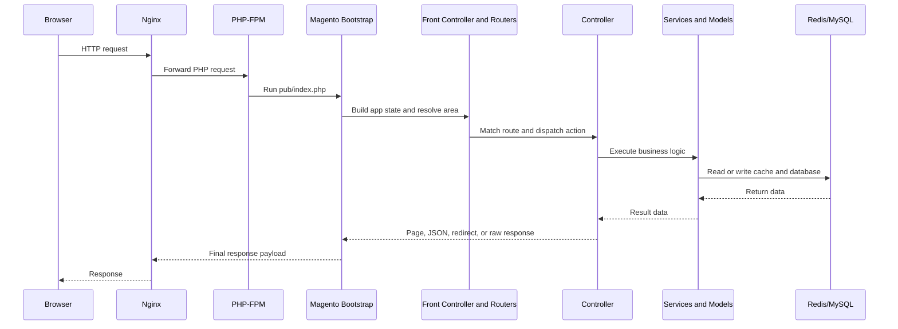

# Magento Request Lifecycle

## What it is

This page explains how a web request enters Magento, gets matched to framework code, and returns a response.

## Why it exists

Magento is a large framework. Without a request lifecycle model, it is difficult to understand where routing, dependency injection, layout, plugins, and database access actually fit.

## When to use it

Use this model when:

- tracing a storefront or admin page
- debugging why a controller did not run
- understanding why `frontend` and `webapi_rest` behave differently
- deciding where a plugin or observer should attach

## Alternative approaches

The wrong alternative is to picture Magento as one monolithic class that “handles the request.” In reality, request handling is staged:

- bootstrap loads config and object manager state
- routers decide which action should handle the request
- controller returns a result type
- deeper services and models perform business logic

## Magento-specific example

A category page request can involve:

1. nginx forwarding to `pub/index.php`
2. Magento bootstrapping the `frontend` area
3. routers matching the URL to a controller
4. controller returning a page result
5. layout and blocks building the page structure
6. product/category services loading data
7. cache layers reducing repeated work

For REST endpoints, the area and dispatch path differ, which is why `frontend` DI assumptions do not always apply to `webapi_rest`.

## Common mistakes

- Assuming a plugin in one area will apply everywhere.
- Debugging layout XML for a route that never reached a page result.
- Looking at controller code when the request never matched the expected router.
- Forgetting that generated code and interception can change the actual runtime call path.

## Related pages

- [How the Web Works End to End](../01-web-foundations/how-the-web-works-end-to-end.md)
- [HTTP, Headers, Cookies, and Sessions](../01-web-foundations/http-requests-responses-headers-cookies-sessions.md)
- [Nginx, PHP-FPM, MySQL, Redis: Who Does What](../04-runtime-devops/nginx-php-fpm-mysql-redis-who-does-what.md)

