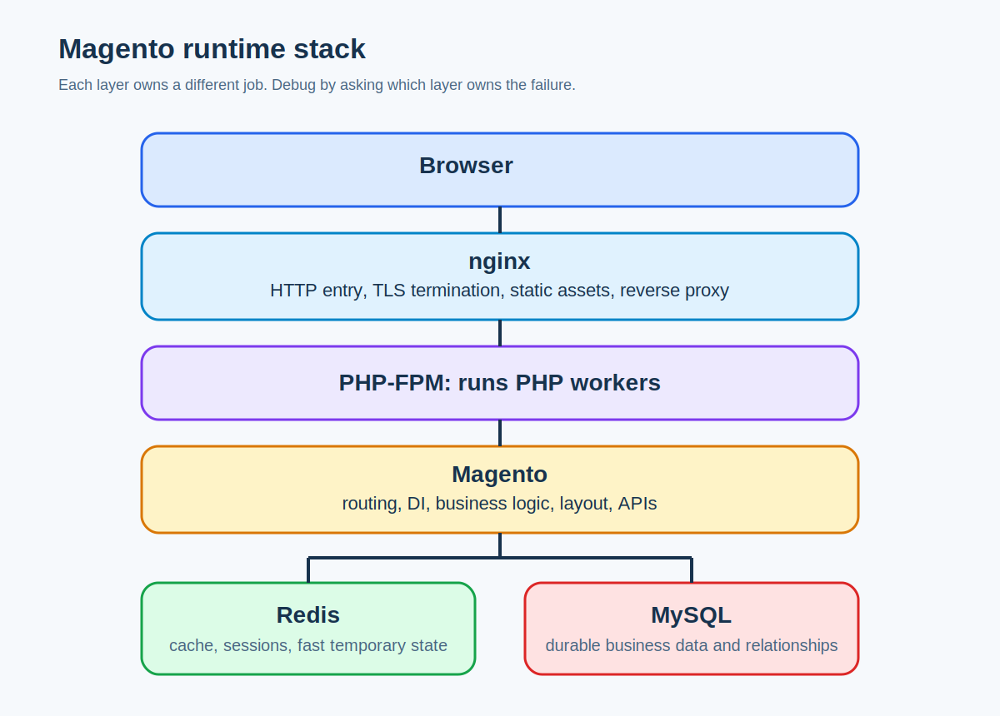

# Nginx, PHP-FPM, MySQL, Redis: Who Does What

## What it is

These are four different runtime components commonly found around a Magento installation:

- nginx: web server and reverse proxy
- PHP-FPM: PHP worker manager
- MySQL: durable relational database
- Redis: fast in-memory store

## Why it exists

A production web app is split across specialized tools because one process should not do everything. Each layer is optimized for a different kind of work.

## When to use it

Use this model when debugging:

- slow page loads
- stale content
- session problems
- data persistence issues
- CLI vs web differences

## Alternative approaches

The wrong alternative is to treat these tools as interchangeable “backend stuff.” They are not:

- nginx is about HTTP entry, routing, and static assets
- PHP-FPM is about executing PHP code
- MySQL is about durable business data
- Redis is about fast temporary data

## Magento-specific example

A logged-in customer opens the cart:

- nginx accepts the request
- PHP-FPM runs Magento code
- Redis may hold session and cache data
- MySQL holds quote, customer, product, and sales data

If the cart looks stale, the problem may be cache or session state rather than the cart tables themselves.

## Common mistakes

- Thinking Redis is a replacement for MySQL. It is not.
- Thinking nginx runs PHP code. It delegates.
- Blaming Magento code for every slow request before checking whether PHP-FPM workers are saturated.
- Assuming data written to cache is durable business truth.

## Related pages

- [How the Web Works End to End](../01-web-foundations/how-the-web-works-end-to-end.md)
- [HTTP, Headers, Cookies, and Sessions](../01-web-foundations/http-requests-responses-headers-cookies-sessions.md)
- [Magento Request Lifecycle](../03-magento-core/magento-request-lifecycle.md)

